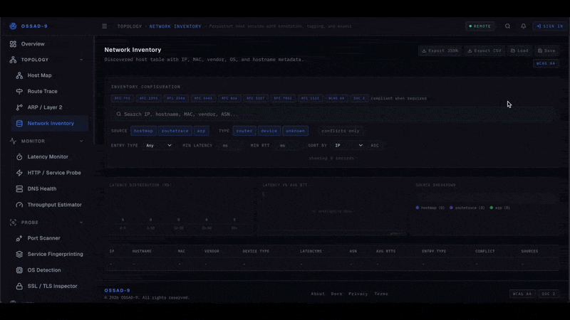
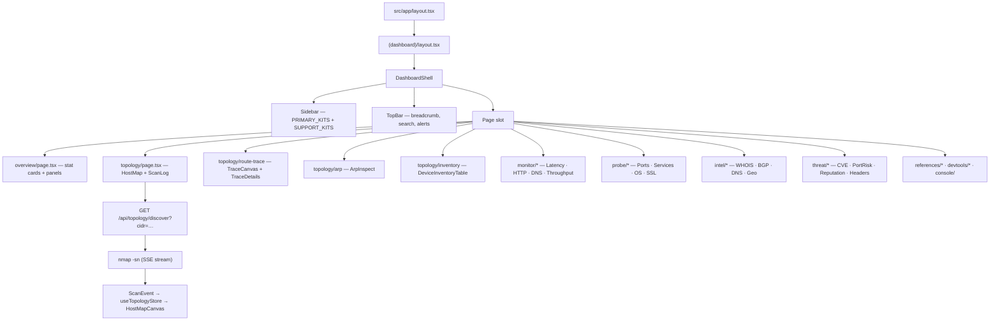

<div align="center">

# OSSAD-9

<p align="center">
  <a href="https://github.com/abiel-source/OSSAD9/stargazers"></a>
  <a href="https://github.com/abiel-source/OSSAD9/network/members"></a>
  <a href="#tech-stack"></a>
  <a href="LICENSE"></a>
</p>

<p align="center">
  <a href="https://github.com/abiel-source/OSSAD9/issues"></a>
  <a href="https://github.com/abiel-source/OSSAD9/pulls"></a>
  
  
  
</p>

</div>

<p align="center">
  
</p>

An enterprise-grade network intelligence platform built with Next.js 16 and React 19. OSSAD-9 provides a unified dashboard for topology mapping, real-time monitoring, host probing, threat intelligence, and network-layer tooling — all from a single dark-mode interface with a monospace-first design system.

<details>
  <summary><b>Table of Contents</b></summary>

- [Overview](#overview)
- [Features](#features)
- [Tech Stack](#tech-stack)
- [Architecture](#architecture)
- [Quick Start](#quick-start)
- [System Requirements](#system-requirements)
- [Scripts](#scripts)
- [Project Structure](#project-structure)
- [Deployment](#deployment)
- [Local vs. Remote Mode](#local-vs-remote-mode)
- [Toolkits Reference](#toolkits-reference)
- [Design System](#design-system)
- [FAQ](#faq)
- [Contributing](#contributing)
- [Maintainer](#maintainer)
- [License](#license)

</details>

---

## Overview

OSSAD-9 is a dashboard shell housing five primary network toolkits and two support toolkits, each containing purpose-built tools that call real system utilities on the server (`nmap`, traceroute, etc.) and stream results back to the client via **Server-Sent Events (SSE)**. The app degrades gracefully to simulated data when running on Vercel or other serverless environments where raw socket access is unavailable.

The interface is designed around a persistent sidebar with collapsible toolkit groups, a breadcrumb-aware top bar, and a unified tool layout component — so every tool feels like a first-class citizen of the same system.

---

## Features

**Topology**

- **Host Map** — Subnet discovery via `nmap -sn`, visualized as an interactive star-topology graph with latency-coded node colors and automatic gateway identification.
- **Route Trace** — Hop-by-hop path analysis with ASN annotation, RTT probes, and timeout-aware canvas rendering. RFC 792 / 1393 / 2544 / 4443 compliant.
- **ARP / Layer 2** — MAC-to-IP mapping, OUI vendor resolution, and L2 conflict detection (duplicate IP, duplicate MAC, static violations). RFC 826 / 5227 / 7042 compliant.
- **Network Inventory** — Cross-source host catalogue that merges data from Host Map, Route Trace, and ARP into a single annotated, exportable device record.

**Monitor**

- **Latency Monitor** — Live RTT tracking with jitter, packet loss, and configurable threshold alerting.
- **HTTP / Service Probe** — Uptime, response time, SSL expiry, and redirect chain monitoring.
- **DNS Health** — Multi-resolver comparison, DNSSEC validation, and propagation checks.
- **Throughput Estimator** — Bandwidth-delay product, TCP throughput ceiling, and MTU path discovery.

**Probe**

- **Port Scanner** — TCP/UDP port discovery with configurable scan techniques and timing profiles.
- **Service Fingerprinting** — Banner grabbing, version detection, and CPE string extraction.
- **OS Detection** — TCP/IP stack fingerprinting with confidence-scored OS identification.
- **SSL / TLS Inspector** — Certificate chain analysis, cipher suites, protocol versions, and HSTS audit.

**Intel**

- **WHOIS / RDAP** — Domain registration, IP block ownership, and ASN allocation data.
- **BGP / ASN** — Autonomous system details, announced prefixes, and routing visibility.
- **DNS Intelligence** — Full record enumeration, mail security analysis, and zone transfer detection.
- **Geolocation** — IP-to-location with organization context, hosting provider, and proxy detection.

**Threat**

- **CVE Lookup** — CPE-to-CVE mapping against NVD with CVSS scoring and bulk scan analysis.
- **Port Risk Audit** — Security posture scoring, unnecessary service detection, and CIS baseline checks.
- **IP & Domain Reputation** — Multi-feed blocklist check, abuse classification, and threat intelligence lookup.
- **Security Header Audit** — HTTP security header grading, cookie flag analysis, and CSP validation.

**Support Toolkits**

- **References** — Port directory, protocol numbers, CIDR tables, and curated RFC index.
- **Dev Tools** — Subnet calculator, IP utilities, MAC/OUI tools, data/bandwidth converter, Base64/hash/JWT encoder, and Unix timestamp utility.
- **Terminal** — Unified command execution interface for direct system tool access.

---

## Tech Stack

| Layer           | Library / Tool                                |
| --------------- | --------------------------------------------- |
| Framework       | Next.js 16.2 (App Router)                     |
| UI Runtime      | React 19                                      |
| Language        | TypeScript 5                                  |
| Styling         | Tailwind CSS 4                                |
| State           | Zustand 5                                     |
| Validation      | Zod 4                                         |
| Charts          | Recharts 3                                    |
| Icons           | Lucide React                                  |
| Fonts           | Geist Sans, IBM Plex Mono                     |
| Backend tooling | Node.js `child_process` → `nmap`              |
| Streaming       | Server-Sent Events (SSE) via `ReadableStream` |

---

## Architecture



---

## Quick Start

**Prerequisites**

- Node.js 18+ (20+ recommended)
- `nmap` installed and in `PATH` — required for live network scanning on local deployments

**Install and run**

```bash
git clone https://github.com/abiel-source/OSSAD9.git
cd ossad9
npm install
npm run dev
```

Open [http://localhost:3000](http://localhost:3000) — the app redirects to `/overview` on load.

**Build and preview**

```bash
npm run build
npm start
```

---

## System Requirements

| Requirement            | Purpose                                        |
| ---------------------- | ---------------------------------------------- |
| `nmap`                 | Host Map subnet discovery, ping sweep          |
| Root / sudo (optional) | Required for SYN scans and OS detection probes |
| Node.js 18+            | Next.js App Router + streaming API routes      |

Install nmap:

```bash
# macOS
brew install nmap

# Ubuntu / Debian
sudo apt install nmap

# Windows (run as Administrator)
# Download installer from https://nmap.org/download.html
```

---

## Scripts

| Script          | Action                                   |
| --------------- | ---------------------------------------- |
| `npm run dev`   | Start Next.js dev server with hot reload |
| `npm run build` | Compile and optimize production build    |
| `npm start`     | Serve the production build               |
| `npm run lint`  | Run ESLint across the project            |

---

## Project Structure

```
ossad9/
├── next.config.ts              # Next.js config
├── tsconfig.json
├── package.json
└── src/
    ├── app/
    │   ├── layout.tsx          # Root layout — fonts, metadata
    │   ├── page.tsx            # Redirects → /overview
    │   ├── globals.css         # OSSAD-9 design tokens (CSS vars)
    │   ├── (dashboard)/        # Route group — shared dashboard shell
    │   │   ├── layout.tsx
    │   │   ├── overview/
    │   │   ├── topology/       # Host Map · Route Trace · ARP · Inventory
    │   │   ├── monitor/        # Latency · HTTP · DNS · Throughput
    │   │   ├── probe/          # Ports · Services · OS · SSL
    │   │   ├── intel/          # WHOIS · BGP · DNS · Geo
    │   │   ├── threat/         # CVE · Port Risk · Reputation · Headers
    │   │   ├── references/     # Ports · Protocols · Subnets · RFC
    │   │   ├── devtools/       # Subnet · IP · MAC · Data · Encode · Timestamp
    │   │   ├── console/        # Terminal
    │   │   └── projects/
    │   └── api/
    │       └── topology/
    │           └── discover/   # SSE route — spawns nmap, streams ScanEvents
    ├── components/
    │   ├── layout/             # DashboardShell · Sidebar · TopBar · Footer
    │   ├── tools/              # ToolHeader · ComplianceBadge · per-tool components
    │   │   ├── arp-inspect/
    │   │   ├── host-map/       # HostMapCanvas (star graph) · HostMapInputs
    │   │   ├── inventory/      # DeviceInventoryTable · InventoryStats
    │   │   └── route-trace/    # TraceCanvas · TraceDetails · TraceInputs
    │   ├── topology/           # ScanLog
    │   └── ui/                 # SubToolStub
    ├── lib/
    │   ├── compliance.ts       # RFC → description mapping
    │   ├── graph.tsx           # GraphNode types, StarGraph, class-to-color
    │   └── nav.ts              # PRIMARY_KITS, SUPPORT_KITS, ALL_ROUTES
    ├── store/
    │   ├── topology.ts         # Zustand — scan state, SSE event handler
    │   ├── routetrace.ts       # Zustand — hop state
    │   ├── arp.ts              # Zustand — ARP entry state
    │   └── ui.ts               # Zustand — sidebar collapsed/open
    └── types/
        └── network.ts          # DiscoveredHost · Hop · ArpEntry · ScanEvent · InventoryItem
```

---

## Deployment

**Local (recommended for real scanning)**

Running locally gives full access to `nmap` and any other system tools. No environment variables are required to get started.

```bash
npm run build && npm start
```

**Vercel (demo / remote mode)**

Deploy directly from the repository. Because Vercel Functions cannot spawn native processes, the topology tools fall back to simulated data automatically and display an in-app warning. All UI, References, Dev Tools, and client-side features work without restriction.

Build settings:

- Framework preset: **Next.js**
- Build command: `npm run build`
- Output directory: `.next`

---

## Local vs. Remote Mode

OSSAD-9 detects at runtime whether a live network backend is available.

| Mode              | How it activates                       | Behavior                                           |
| ----------------- | -------------------------------------- | -------------------------------------------------- |
| **Local**         | `nmap` present in `PATH` on the server | Real subnet scans, live SSE stream                 |
| **Remote / Demo** | Serverless environment (Vercel, etc.)  | Simulated scan data, warning displayed in scan log |

The simulation is intentionally realistic — it walks through mock hosts with staggered `setTimeout` dispatches to exercise the full SSE event pipeline, including pause/resume and stop controls.

---

## Toolkits Reference

| Toolkit    | Tools                                                   | Key protocols     |
| ---------- | ------------------------------------------------------- | ----------------- |
| Topology   | Host Map, Route Trace, ARP/L2, Inventory                | ICMP, ARP, SSE    |
| Monitor    | Latency, HTTP Probe, DNS Health, Throughput             | ICMP, HTTP/S, DNS |
| Probe      | Port Scanner, Service FP, OS Detection, SSL/TLS         | TCP, UDP, TLS     |
| Intel      | WHOIS/RDAP, BGP/ASN, DNS Intel, Geolocation             | RDAP, BGP, DNS    |
| Threat     | CVE Lookup, Port Risk, Reputation, Sec Headers          | NVD, HTTP         |
| References | Port Dir, Protocols, CIDR Tables, RFC Index             | —                 |
| Dev Tools  | Subnet Calc, IP Utils, MAC/OUI, Data, Encode, Timestamp | —                 |

RFC compliance badges are displayed per-tool. Current annotated RFCs: 792, 826, 1122, 1393, 2544, 4443, 5227, 7042.

---

## Design System

OSSAD-9 uses a custom CSS variable design system defined in `globals.css`. All components reference these tokens — never raw color values.

| Token                    | Value     | Usage                               |
| ------------------------ | --------- | ----------------------------------- |
| `--ossad-bg-primary`     | `#09090f` | Page background                     |
| `--ossad-bg-surface`     | `#0f0f1a` | Cards, panels, top bar              |
| `--ossad-bg-elevated`    | `#14141f` | Dropdowns, overlays                 |
| `--ossad-accent`         | `#367bf0` | Interactive elements, active routes |
| `--ossad-cyan`           | `#22d3ee` | Secondary highlight                 |
| `--ossad-online`         | `#10b981` | Success, host up, scan complete     |
| `--ossad-cautious`       | `#f59e0b` | Warning state, moderate latency     |
| `--ossad-catastrophic`   | `#ef4444` | Error state, high latency, threat   |
| `--ossad-border`         | `#1e1e2e` | All borders                         |
| `--ossad-text-primary`   | `#e2e8f0` | Body text                           |
| `--ossad-text-secondary` | `#64748b` | Labels, descriptions                |

Typography: **Geist Sans** for UI text, **IBM Plex Mono** for all data values, labels, badges, and monospace-prefixed elements.

---

## FAQ

**Scan returns no hosts?**
Confirm `nmap` is installed (`nmap --version`) and that it's in your `PATH`. On some systems, ping sweeps require elevated privileges — try running with `sudo`.

**Dev server starts but topology scan immediately errors?**
The `/api/topology/discover` route spawns `nmap` as a child process. This requires Node.js to have process spawning permissions. Docker and some sandboxed environments may block this.

**Running on Vercel but want real scans?**
Switch to a local deployment or a self-hosted server with `nmap` installed. Vercel's serverless runtime does not support native process spawning.

**Can I add a new tool?**
Yes. Add an entry to `PRIMARY_KITS` or `SUPPORT_KITS` in `src/lib/nav.ts`, create the route under `src/app/(dashboard)/`, and build the tool page using `ToolHeader` + your UI components. The sidebar and breadcrumb system pick it up automatically.

---

## Contributing

Contributions, issues, and feature requests are welcome.

1. Fork the repo
2. Create a feature branch (`git checkout -b feat/your-feature`)
3. Commit using conventional commits (`feat:`, `fix:`, `chore:`, etc.)
4. Open a pull request against `main`

Please open an issue before starting large features so we can align on scope and approach.

---

## Maintainer

<table>
  <tr>
    <td>
      <b>Abiel Kim</b><br/>
      <a href="https://github.com/abiel-source">GitHub</a>
    </td>
  </tr>
</table>

---

## License

This project is open source. See `LICENSE` for terms.
